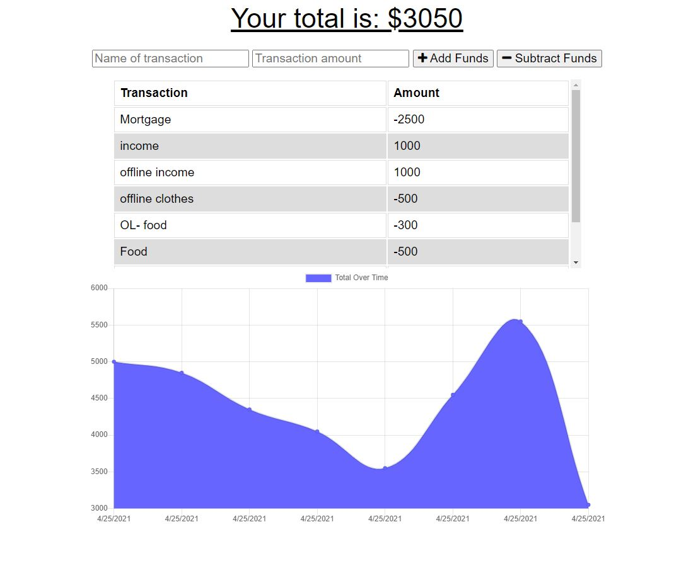

# Budget Tracker

## Description

This app lets the user to record spending activity by entering expenses and income. The user will be able to enter data into the program even if they are in an offline states; when back online, the data syncs to database. A chart is generated to allow a visual scale of spending habits. 

## Mock-Up

This is first look at what the app looks like

[I am a link to the web page](https://mysterious-garden-26246.herokuapp.com/)

## Usage 

There are no installations required when visiting the site. The user can right way ender a description of the expense/income and either add or subtract in order to save. The chart will automatically generate when expenses are entered. If for what ever reason the user loses connection, the posts will not be lost and will sync when back online. 

## License

These files don't have a license and are there to fully share.

---